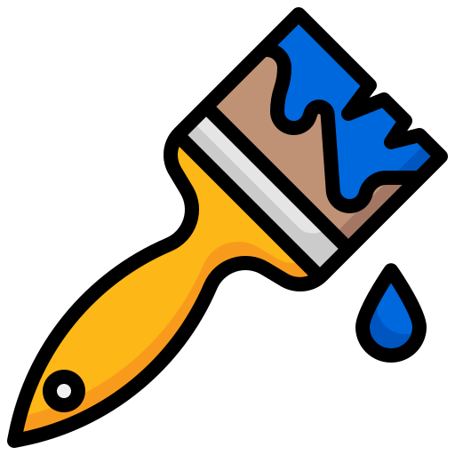

# Multiplayer Drawing Game - Splashh

Splashh is a **Multiplayer Drawing Game** with real-time interactions powered by WebSockets, MediaPipe Hands, and JavaScript. Players can join a game, use hand gestures to draw on a shared canvas, and compete to fill the most canvas area while utilizing various power-ups.

Gameplay Snippet


[Complete Video Walkthrough](https://youtu.be/SlA19znMufY?si=TuDvYnA9aIcu4sZw)


## Table of Contents
- [Features](#features)
- [Tech Stack](#tech-stack)
- [Setup](#setup)
- [How to Run](#how-to-run)
- [How It Works](#how-it-works)
- [Code Overview](#code-overview)
- [Power-Ups](#power-ups)
- [Future Enhancements](#future-enhancements)
- [Contributing](#contributing)
- [License](#license)


## Features
- **Real-Time Multiplayer Drawing**: Players can draw on a shared canvas using MediaPipe Hands for gesture tracking.
- **WebSocket Communication**: Ensures smooth, real-time updates between the server and clients.
- **Power-Ups**: Players can collect and use power-ups like erasers, paint buckets, and more to influence gameplay.
- **Countdown Timer and Score Display**: Tracks the game duration and dynamically displays scores.
- **Gesture-Based Controls**: Use hand gestures to start/reset the game.


## Tech Stack
- **Frontend**:
  - HTML5 Canvas for drawing
  - MediaPipe Hands for hand gesture tracking
  - WebSocket client for real-time communication
  - Modern CSS3 for UI/UX

- **Backend**:
  - Python WebSocket server
  - NumPy for canvas data management
  - Asyncio for asynchronous operations

## How to Run

### Server
1. Start the WebSocket server:
```python server.py```

### Client
2. Open the `index.html` file in a modern web browser with webcam access.

Note: For the hackathon, I am deploying the server on ngrok for temporary basis to showcase multiplayer interactivity.

## How It Works

### General Flow
- The **server** (`server.py`) manages client connections, broadcasts updates about the shared canvas, power-ups, and game events.
- The **client** (`client.js`) handles:
  - Hand tracking using MediaPipe Hands
  - Canvas drawing and updates
  - WebSocket communication
  - Power-up effects and game state management

### Game Modes
- **Start Gestures**: Keep index and middle finger upright and move your hand over the "START" button to begin.
- **Reset Gestures**: Keep index and middle finger upright and move your hand over the "RESET" button to reset the game.

### Real-Time Drawing
- The index finger is tracked for drawing on the canvas
- Draw paths are broadcast to all connected players via WebSocket
- Canvas updates are synchronized across all clients

## Power-Ups
### List of Power-Ups
1.   **Eraser**: Temporarily (5 secs) allows the player to erase opponent drawings.
2.  **Devil Face**: Reduces the opponent's brush size for 5 seconds.
3.  **Paint Bucket**: Fills a random area on the canvas with the player's color.
4.  **Paint Brush**: Temporarily (5 secs) increases the player's brush size.

### Power-Up Spawning
- Power-ups spawn at random intervals (5-10 seconds)
- Random locations on the canvas
- Collected by touching with the index finger

## Future Enhancements
- Improve hand-tracking accuracy for complex gestures
- Add more power-ups and effects
- Create a UI for lobby management (e.g., joining/leaving games)
- Deploy the WebSocket server to cloud-based platforms for wider accessibility
- Suite of Games Based on Virtual Drawing. For instance, a virtual Pictionary game
- Explore integrations with platforms like Zoom or Microsoft Teams. Splashh could be used as a fun and engaging icebreaker for virtual meetings, energizing participants and encouraging collaboration before diving into business discussions.