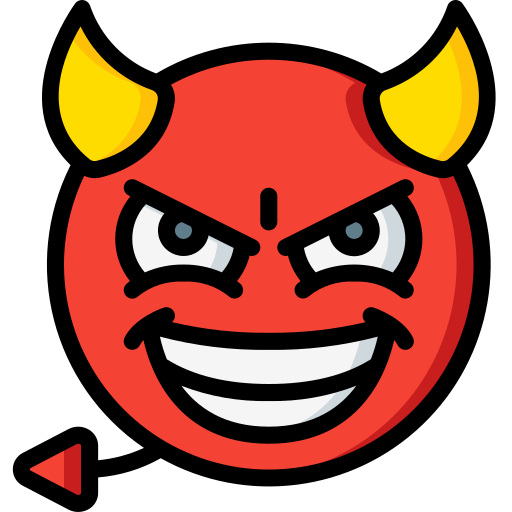
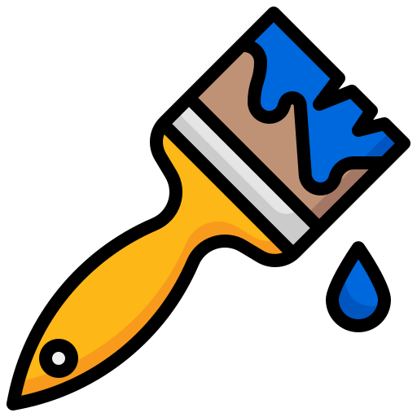

# Multiplayer Drawing Game - Splashh

Splashh is a **Multiplayer Drawing Game** with real-time interactions powered by WebSockets, MediaPipe Hands, and JavaScript. Players can join a game, use hand gestures to draw on a shared canvas, and compete to fill the most canvas area while utilizing various power-ups.

Gameplay Snippet


[Complete Video Walkthrough - Old version](https://youtu.be/SlA19znMufY?si=TuDvYnA9aIcu4sZw)

## Features
- **Real-Time Multiplayer Drawing**: Players can draw on a shared canvas using MediaPipe Hands for gesture tracking
- **WebSocket Communication**: Ensures smooth, real-time updates between the server and clients
- **Power-Ups**: Players can collect and use power-ups like erasers, paint buckets, and more to influence gameplay
- **Countdown Timer and Score Display**: Tracks the game duration and dynamically displays scores
- **Gesture-Based Controls**: Use hand gestures to start/reset the game
- **Username System**: Players can set custom usernames for better identification
- **Responsive Design**: Adapts to different screen sizes while maintaining aspect ratio
- **Sound Effects**: Audio feedback for game events, power-ups, and winner announcements
- **Canvas Synchronization**: Real-time canvas updates across all connected players
- **Score Tracking**: Percentage-based scoring system for fair competition

## Tech Stack
- **Frontend**:
  - HTML5 Canvas for drawing
  - MediaPipe Hands for hand gesture tracking
  - WebSocket client for real-time communication
  - Modern CSS3 for UI/UX
  - JavaScript for game logic and interactions

- **Backend**:
  - Python WebSocket server (aiohttp)
  - NumPy for canvas data management
  - Asyncio for asynchronous operations
  - Docker for containerization

## Installation & Setup

### Local Development
1. Clone the repository:
```bash
git clone https://github.com/Sakshee5/multiplayer-virtual-painting-game.git
cd multiplayer-virtual-painting-game
```

2. Install dependencies:
```bash
# Server dependencies
cd server
pip install -r requirements.txt

# Client dependencies (none required, uses CDN for libraries)
```

3. Start the server:
```bash
python server.py
```

4. Open `client/index.html` in a web browser with webcam access.

### Docker Deployment
Access the game at `https://vcm-47044.vm.duke.edu/`

## How It Works

### General Flow
- The **server** (`server.py`) manages:
  - Client connections and disconnections
  - Game state and synchronization
  - Power-up spawning and management
  - Score tracking and winner determination
  - Real-time canvas updates

- The **client** (`client.js`) handles:
  - Hand tracking using MediaPipe Hands
  - Canvas drawing and updates
  - WebSocket communication
  - Power-up effects and game state management
  - User interface and interactions

### Game Controls
- **Start Game**: Keep index and middle fingers upright and move over the "START" button
- **Reset Game**: Keep index and middle fingers upright and move over the "RESET" button
- **Drawing**: Use index finger to draw on the canvas
- **Power-up Collection**: Touch power-ups with index finger to collect them

### Real-Time Drawing
- Index finger tracking for precise drawing
- Real-time path broadcasting to all players
- Synchronized canvas updates across clients
- Brush thickness and color management

## Power-Ups
### Available Power-Ups
1.  **Eraser**: Temporarily (5 secs) allows erasing opponent drawings
2.  **Devil Face**: Reduces opponent's brush size for 5 seconds
3.  **Paint Bucket**: Fills a random area with player's color
4.  **Paint Brush**: Temporarily increases brush size

### Power-Up Mechanics
- Random spawning every 10-15 seconds
- Unique IDs for each power-up
- Visual indicators on the canvas
- Sound effects on collection
- Temporary effects (5-second duration)

## Ethics Statement

This project adheres to the following ethical principles:

1. **Privacy & Data Protection**:
   - No personal data is stored or transmitted beyond usernames
   - Webcam data is processed locally and never stored
   - All communications are encrypted using HTTPS/WSS

2. **Accessibility**:
   - Designed to work with standard web browsers
   - Clear visual feedback for all actions
   - Audio cues for important events

3. **Fair Play**:
   - Equal starting conditions for all players
   - Transparent scoring system
   - Random power-up distribution


## Future Enhancements
- Improve hand-tracking accuracy for complex gestures
- Add more power-ups and effects
- Create a UI for lobby management
- Deploy to cloud platforms for wider accessibility
- Suite of Games Based on Virtual Drawing (e.g., Pictionary)
- Platform integrations (Zoom, Microsoft Teams)
- Enhanced accessibility features
- Mobile device support